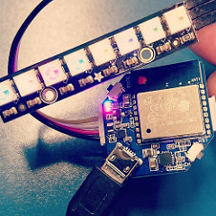

mqtt_neopixel.ino
====

How to use:
----

    $ git clone https://github.com/yoggy/mqtt_neopixel
    $ cd mqtt_neopixel
    $ cp config.ino.sample config.ino
    $ vi config.ino
      - edit wifi_ssid, wifi_password, mqtt_server, mqtt_subscribe_topic, ... etc
    $ open mqtt_neopixel.ino

How to connect WioNode and NeoPixel
----

Reference
----
- https://github.com/yoggy/arduinoize_wio_node
- http://akizukidenshi.com/catalog/g/gM-10631/
- http://akizukidenshi.com/catalog/g/gM-08435/

Copyright and license
----

Copyright (c) 2016 yoggy

Released under the [MIT license](LICENSE.txt)